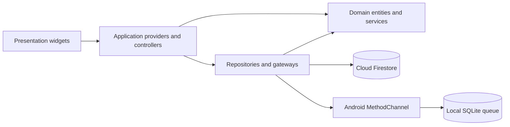
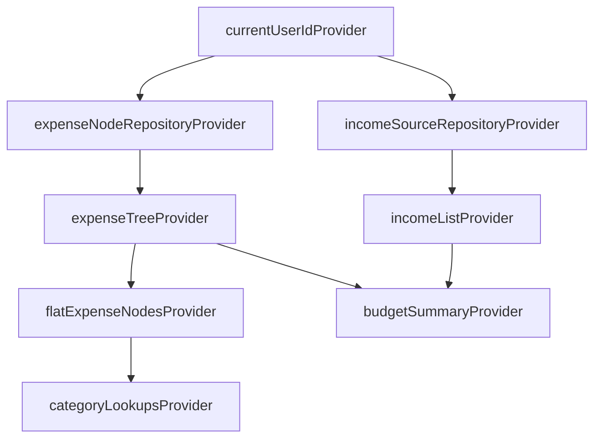
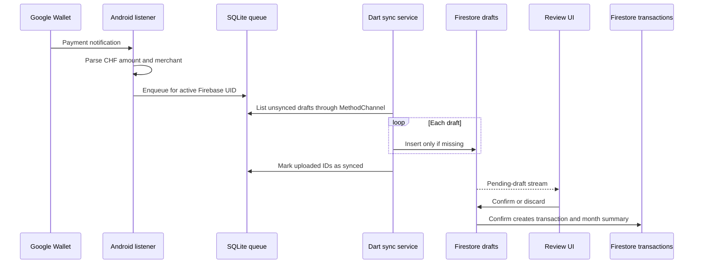

# Stutz Project Description

Last updated: 2026-08-27

## 1. Project purpose

Stutz is a Flutter budget-planning and expense-tracking application focused on answering two questions:

1. What income and planned costs does the user have?
2. How much of the user's variable budget has actually been spent?

The application supports:

- Google and anonymous Firebase authentication;
- hierarchical income and expense planning;
- monthly and yearly payment intervals;
- fixed and variable expense categories;
- manual transaction entry and editing;
- paginated transaction history grouped by day;
- monthly and yearly budget analytics;
- Android import of Google Wallet payment notifications;
- Firestore synchronization and offline caching;
- local Firestore backup, restore, and month-summary migration tools;
- automated Flutter, Firestore rules, and Node.js tests;
- Android APK and App Bundle release automation.

The user interface is primarily German and uses Swiss formatting and CHF as its working currency.

Known design risks and planned changes are documented separately in [refactoring-audit.md](refactoring-audit.md).

## 2. Technology overview

| Area | Technology | Role |
| --- | --- | --- |
| Application framework | Flutter / Dart | Cross-platform UI and application runtime |
| UI system | Material 3 | Navigation, forms, dialogs, cards, and visual components |
| State management | Riverpod 3 with code generation | Reactive reads, asynchronous state, dependency injection, and mutation state |
| Local widget state | Flutter Hooks | Form controllers, selected values, and effect cleanup |
| Immutable models | Freezed | Immutable entities and view models with equality and `copyWith` |
| Authentication | Firebase Authentication | Google sign-in and anonymous guest accounts |
| Cloud storage | Cloud Firestore | Per-user budgets, transactions, drafts, rules, and derived month summaries |
| Local preferences | SharedPreferences | Device-local onboarding completion and native active-owner state |
| Android local queue | SQLite | Durable queue for captured Google Wallet notifications |
| Native bridge | Flutter MethodChannel | Communication between Dart and Android notification-capture code |
| Date and number formatting | `intl` | German/Swiss dates, month labels, and CHF display |
| Month boundaries | `timezone` | Consistent `Europe/Zurich` transaction month calculation |
| Transaction list | `scrollable_positioned_list` | Infinite history plus direct scrolling to a selected month |
| Administrative tooling | Node.js and Firebase Admin SDK | Backup, restore, and transaction-month migration |
| CI/CD | GitHub Actions | Formatting, analysis, generation checks, tests, Android builds, and releases |

The exact package versions and launcher configuration are defined in [pubspec.yaml](../pubspec.yaml). Node.js scripts and their dependencies are defined in [package.json](../package.json).

## 3. Architectural style

The Dart application uses a feature-first structure. Each substantial feature owns its application, data, domain, and presentation code where those layers are needed.

```text
lib/
|-- main.dart
|-- firebase_options.dart
|-- app/
|-- core/
|-- features/
|   |-- auth/
|   |-- budget/
|   |-- dashboard/
|   |-- notification_import/
|   `-- transactions/
`-- shared/
```

The intended dependency direction is:



### Layer responsibilities

- **Presentation** renders state and translates user gestures into application commands.
- **Application** composes providers, exposes asynchronous state, and coordinates mutations.
- **Domain** contains business entities, immutable view models, and pure calculations.
- **Data** maps storage formats, executes Firestore queries, and bridges platform APIs.
- **Shared/Core** contains reusable UI and application-wide infrastructure.

Generated `*.g.dart` and `*.freezed.dart` files implement Riverpod and Freezed boilerplate. They are generated artifacts and should not be edited manually.

## 4. Application startup and navigation

### 4.1 Entry point

[lib/main.dart](../lib/main.dart) is the process entry point.

Startup occurs in this order:

1. Flutter bindings are initialized.
2. Zurich timezone data is initialized through `TransactionMonth.initialize()`.
3. Debug builds enable `WakelockPlus` to keep the development device awake.
4. The widget tree starts inside a root `ProviderScope`.
5. `MainApp` initializes Firebase using generated platform options.
6. A loading screen is shown while Firebase starts.
7. Initialization failures show a retryable error screen.
8. Successful initialization hands control to `AppRouter`.

`MainApp` also configures:

- the application title;
- the `de_CH` locale;
- Flutter localization delegates;
- the Material theme;
- removal of the debug banner.

[lib/firebase_options.dart](../lib/firebase_options.dart) is generated by FlutterFire and provides Android/iOS Firebase client configuration.

### 4.2 Root router

[lib/app/app_router.dart](../lib/app/app_router.dart) is an authentication-driven root router rather than a URL-based navigation router.

It watches `authStateProvider` and selects one of four states:

- unresolved authentication -> `AppLoadingScreen`;
- authentication stream failure -> retry screen;
- signed out -> onboarding/login router;
- signed in -> authenticated home.

The signed-out router reads the device-local `seenOnboardingProvider`:

- first use opens `WelcomeScreen`;
- completed onboarding opens `LoginScreen`.

The router also distinguishes voluntary sign-out from an unexpected transition to a signed-out Firebase state. Unexpected logout shows a user-facing message.

For authenticated users, `_AuthenticatedHome` listens for pending notification drafts. It opens one review session at a time and tracks drafts handled or deferred during the current widget lifetime so that the same sheet is not immediately reopened.

### 4.3 Main navigation

[lib/app/home_screen.dart](../lib/app/home_screen.dart) provides three bottom-navigation destinations:

1. **Ubersicht** -> dashboard analytics;
2. **Planung** -> budget planning;
3. **Ausgaben** -> transaction history.

An `IndexedStack` keeps all three screens mounted. Switching tabs therefore preserves each screen's local scroll and expansion state.

### 4.4 Startup feedback

[lib/app/app_loading_screen.dart](../lib/app/app_loading_screen.dart) contains:

- `AppLoadingScreen`, used for Firebase, authentication, and settings loading;
- `AppInitializationErrorScreen`, used when Firebase startup fails and offering a retry command.

## 5. Core infrastructure

### 5.1 Theme

[lib/core/theme/app_theme.dart](../lib/core/theme/app_theme.dart) defines the application-wide Material 3 light theme.

It centralizes:

- teal primary and blue secondary colors;
- surface elevations represented through tonal surface colors;
- warning and error colors;
- Manrope display typography and Inter body typography through Google Fonts;
- card shape and color defaults;
- disabled ripple/highlight effects;
- shared text colors and metadata styles.

The app currently exposes only a light theme.

### 5.2 Connectivity state

[lib/core/connectivity/connectivity_provider.dart](../lib/core/connectivity/connectivity_provider.dart) wraps `connectivity_plus` in two keep-alive providers:

- `connectivityStatusProvider` streams available network interface changes;
- `isOfflineProvider` converts that asynchronous state into a boolean.

[lib/shared/widgets/cloud_status_icon.dart](../lib/shared/widgets/cloud_status_icon.dart) watches the boolean and shows a cloud-off icon only when the provider considers the device offline.

This status describes network interface availability. Firestore itself provides the actual data synchronization and offline cache behavior.

### 5.3 Amount parsing

[lib/core/utils/amount_parser.dart](../lib/core/utils/amount_parser.dart) accepts decimal input with either a comma or period. It rejects missing, non-finite, zero, and negative values and exposes both parsing and form-validation helpers.

## 6. Authentication and onboarding

The authentication feature is located under [lib/features/auth](../lib/features/auth).

### 6.1 Data service

[auth_service.dart](../lib/features/auth/data/auth_service.dart) owns Firebase Auth and Google Sign-In SDK calls.

`AuthService` provides:

- `authStateChanges`, the Firebase authentication stream;
- anonymous sign-in;
- Google authentication and Firebase credential exchange;
- combined Google/Firebase sign-out;
- logging for authentication failures and canceled Google account selection.

Google Sign-In is initialized lazily using the web client ID from [firebase_config.dart](../lib/features/auth/data/firebase_config.dart).

### 6.2 Application providers

[auth_providers.dart](../lib/features/auth/application/auth_providers.dart) exposes the feature to the rest of the application:

- `authServiceProvider` supplies the SDK wrapper;
- `authStateProvider` streams the current Firebase `User?`;
- `currentUserIdProvider` exposes only the UID to other features;
- `AuthController` owns sign-in and sign-out mutation state;
- `VoluntarySignOut` records whether a logout was requested by the user;
- `seenOnboardingProvider` reads the local onboarding flag;
- `OnboardingController` writes that flag and refreshes its provider.

The auth state and mutation controller are kept alive because routing depends on them for the entire application lifetime.

### 6.3 Presentation flow

[welcome_screen.dart](../lib/features/auth/presentation/welcome_screen.dart) is the first-use introduction and opens the tutorial.

[tutorial_screen.dart](../lib/features/auth/presentation/tutorial_screen.dart) presents three pages explaining:

- fixed versus variable costs;
- monthly versus yearly intervals;
- offline use and synchronization.

Completing or skipping the tutorial stores `seenOnboarding = true` in SharedPreferences and returns to the root route.

[login_screen.dart](../lib/features/auth/presentation/login_screen.dart) offers:

- Google sign-in;
- anonymous guest sign-in;
- a single loading state while either request is running;
- a SnackBar when an authentication operation fails.

## 7. Budget planning feature

The budget feature is located under [lib/features/budget](../lib/features/budget). It describes planned income and expenses. Actual transaction analysis belongs to the dashboard feature.

### 7.1 Domain concepts

[enums.dart](../lib/features/budget/domain/enums/enums.dart) defines:

- `PaymentInterval.monthly` and `PaymentInterval.yearly`;
- `ExpenseType.fixed` and `ExpenseType.variable`;
- `IncomeGroup.main` and `IncomeGroup.additional`.

#### Expense nodes

[expense_node.dart](../lib/features/budget/domain/entities/expense_node.dart) is a Freezed entity representing either a category group or a planned expense leaf.

Important fields are:

| Field | Meaning |
| --- | --- |
| `id` | Firestore document ID |
| `parentId` | Parent category ID; `null` means a root category |
| `name` | User-facing category name |
| `plannedAmount` | Planned amount for a leaf; absent for groups |
| `actualAmount` | Calculated-only field that is not persisted |
| `type` | Fixed or variable for expense leaves |
| `interval` | Monthly or yearly for expense leaves |
| `children` | In-memory nested category children |
| `sortOrder` | Ordering within a parent; `99999` is the legacy fallback |

Firestore stores nodes as a flat collection. `children` is reconstructed after reading and is never written into a document.

`validateForWrite()` enforces the domain shape before category mutations:

- IDs and names must not be empty;
- groups cannot have amount, interval, or type values;
- leaves require a finite positive amount, interval, and expense type.

`totalMonthlyCalculated` recursively adds descendants and divides yearly leaf values by 12.

#### Income sources

[income_source.dart](../lib/features/budget/domain/entities/income_source.dart) is a Freezed entity with an ID, name, amount, payment interval, and income group. Its `monthlyAmount` getter converts yearly income into a monthly equivalent.

#### Budget summary

[budget_summary.dart](../lib/features/budget/domain/view_models/budget_summary.dart) is the presentation-ready aggregate containing monthly/yearly fixed and variable amounts. Derived getters calculate yearly income, monthly-equivalent expenses, balance, and deficit state.

[category_lookup.dart](../lib/features/budget/domain/view_models/category_lookup.dart) is a deliberately small cross-feature contract containing only category ID, name, and parent ID. Transaction code uses it without depending on the budget repository.

### 7.2 Pure domain services

[tree_builder.dart](../lib/features/budget/domain/services/tree_builder.dart) converts flat Firestore nodes into a tree.

Before building, it validates:

- non-empty IDs;
- unique IDs;
- existing parent references;
- absence of parent cycles.

Children and roots are sorted by `sortOrder`, then by name. The service can also flatten an existing tree depth-first.

[budget_calculator.dart](../lib/features/budget/domain/services/budget_calculator.dart) performs stateless planning calculations:

- monthly-equivalent total income;
- raw monthly and yearly income totals;
- recursive monthly-equivalent expenses;
- raw monthly and yearly expense totals;
- the complete fixed/variable budget summary.

### 7.3 Firestore mapping and repositories

[expense_node_mapper.dart](../lib/features/budget/data/expense_node_mapper.dart) maps flat `expense_nodes` documents to/from `ExpenseNode`. It parses enum names and applies the legacy `sortOrder` fallback.

[income_source_mapper.dart](../lib/features/budget/data/income_source_mapper.dart) maps `incomes` documents to/from `IncomeSource` and validates numeric amounts.

[expense_node_repository.dart](../lib/features/budget/data/expense_node_repository.dart) operates on:

```text
users/{userId}/expense_nodes/{nodeId}
```

It provides one-shot and streaming tree reads, add/update/delete operations, and batched sort-order updates. Deletion checks that the category has no direct children and is not referenced by a transaction.

[income_source_repository.dart](../lib/features/budget/data/income_source_repository.dart) operates on:

```text
users/{userId}/incomes/{incomeId}
```

It provides one-shot and streaming reads plus add, update, and delete operations.

Both repository providers watch `currentUserIdProvider`. A changed user therefore creates repositories scoped to the new UID.

### 7.4 Riverpod application layer

[budget_providers.dart](../lib/features/budget/application/budget_providers.dart) defines the read graph:



Additional providers calculate total monthly income and expenses. Generated providers are auto-disposed unless explicitly kept alive.

[selectable_categories_provider.dart](../lib/features/budget/application/selectable_categories_provider.dart) flattens the expense tree and exposes only variable expense leaves/groups suitable for assigning transactions.

[budget_mutations.dart](../lib/features/budget/application/budget_mutations.dart) is the write entry point used by presentation code. It exposes add/update/delete methods for categories and incomes and represents progress or failure through `AsyncValue<void>`.

### 7.5 Budget presentation

[budget_planning_screen.dart](../lib/features/budget/presentation/budget_planning_screen.dart) combines three independently asynchronous sections:

- overall budget summary;
- income list;
- hierarchical expense plan.

It also displays connectivity state and the sign-out command.

The dialogs are:

- [add_main_category_dialog.dart](../lib/features/budget/presentation/dialogs/add_main_category_dialog.dart): creates a root group;
- [add_expense_node_dialog.dart](../lib/features/budget/presentation/dialogs/add_expense_node_dialog.dart): creates or edits nested groups and leaves;
- [add_income_dialog.dart](../lib/features/budget/presentation/dialogs/add_income_dialog.dart): creates, edits, or deletes income sources.

The major widgets are:

- [budget_overview_card.dart](../lib/features/budget/presentation/widgets/budget_overview_card.dart): displays available monthly balance and planning breakdowns;
- [income_section_card.dart](../lib/features/budget/presentation/widgets/income_section_card.dart): separates main and additional incomes;
- [income_item_row.dart](../lib/features/budget/presentation/widgets/income_item_row.dart): displays and opens one income for editing;
- [expense_section_card.dart](../lib/features/budget/presentation/widgets/expense_section_card.dart): displays one root category and its actions;
- [expense_item_row.dart](../lib/features/budget/presentation/widgets/expense_item_row.dart): recursively displays, expands, edits, and adds nested expense nodes;
- [legend_row.dart](../lib/features/budget/presentation/widgets/legend_row.dart): shared legend presentation within budget views.

## 8. Transaction feature

The transaction feature is located under [lib/features/transactions](../lib/features/transactions). It stores actual expenses and presents a pageable chronological history.

### 8.1 Domain entities and view models

[app_transaction.dart](../lib/features/transactions/domain/entities/app_transaction.dart) is a Freezed entity containing:

- transaction ID;
- selected expense category ID;
- amount;
- transaction date/time;
- optional note.

The name `AppTransaction` avoids a collision with Firestore's transaction type.

[transaction_with_category.dart](../lib/features/transactions/domain/view_models/transaction_with_category.dart) enriches a transaction with the current category name and parent ID.

[daily_transactions.dart](../lib/features/transactions/domain/view_models/daily_transactions.dart) groups enriched transactions for one calendar date and stores that day's total.

[transaction_month_summary.dart](../lib/features/transactions/domain/entities/transaction_month_summary.dart) represents a derived monthly index containing transaction count and totals keyed by category ID. Its helper computes category deltas when a transaction is edited.

### 8.2 Date/month handling

[transaction_month.dart](../lib/features/transactions/data/transaction_month.dart) centralizes month semantics in `Europe/Zurich`.

It can:

- normalize any timestamp to a Zurich year/month;
- calculate a timezone-aware month boundary;
- encode a month as `YYYY-MM`;
- validate and decode stored month keys;
- return the current Zurich transaction month.

This prevents device timezone differences from placing the same timestamp into different reporting months.

### 8.3 Mappers

[transaction_mapper.dart](../lib/features/transactions/data/transaction_mapper.dart) maps Firestore documents to `AppTransaction`. It accepts Firestore `Timestamp`, Dart `DateTime`, or parseable date strings and writes dates back as `Timestamp` values.

[transaction_month_summary_mapper.dart](../lib/features/transactions/data/transaction_month_summary_mapper.dart) maps month-index documents, clamps invalid negative counts, and ignores malformed category-total entries.

### 8.4 Repository and aggregate maintenance

[transaction_repository.dart](../lib/features/transactions/data/transaction_repository.dart) uses two collections:

```text
users/{userId}/transactions/{transactionId}
users/{userId}/transactionMonths/{YYYY-MM}
```

It provides:

- cursor-based transaction pages ordered newest first;
- the oldest transaction for legacy month-list fallback;
- category transactions within a date interval;
- a stream of month summaries for a selected year;
- indexed month discovery after migration;
- atomic add/update/delete behavior coupled to month-summary changes.

Adding a transaction writes the transaction and increments its month count/category total in one batch. Updating or deleting uses a Firestore transaction to read the previous value and adjust the old and new month/category totals.

The special document below records whether indexed months are available:

```text
users/{userId}/transactionMonths/_meta
```

### 8.5 Grouping and pagination

[transaction_grouper.dart](../lib/features/transactions/domain/services/transaction_grouper.dart) is a pure service that:

1. builds a category lookup map;
2. sorts transactions newest first;
3. enriches each transaction with its current category label;
4. groups records by calendar day;
5. calculates daily totals;
6. returns days newest first.

[transaction_service.dart](../lib/features/transactions/application/transaction_service.dart) contains two generated Riverpod notifiers.

`PaginatedTransactionList`:

- loads 20 Firestore documents per page;
- retains raw transactions and grouped days;
- tracks the last Firestore snapshot cursor;
- distinguishes initial failure from load-more failure;
- prevents duplicate page loads;
- can continue loading until a requested month appears.

`TransactionMutations`:

- adds, updates, and deletes through the repository;
- exposes mutation loading/error state;
- invalidates transaction history and available-month providers after success.

[transaction_state.dart](../lib/features/transactions/application/transaction_state.dart) owns:

- `currentVisibleMonthProvider`, synchronized with list scrolling and month selection;
- `availableMonthsProvider`, which reads indexed months after migration or derives a continuous legacy range from the oldest transaction.

### 8.6 Transaction presentation

[transaction_screen.dart](../lib/features/transactions/presentation/transaction_screen.dart) coordinates the month selector and positioned transaction list.

Its scroll behavior:

- requests another page when user scrolling approaches the list end;
- updates the visible-month provider from currently visible day groups;
- suppresses feedback loops during programmatic month jumps;
- loads additional pages when the selected month is not yet present;
- shows an inline retry footer for load-more failures.

The app bar also exposes notification-capture access and pending-draft actions on supported Android devices.

[add_transaction_dialog.dart](../lib/features/transactions/presentation/add_transaction_dialog.dart) supports create, edit, and delete. It validates amount/category, limits dates to 2020 through today, uses UUIDs for new records, and uses the variable-category picker.

Presentation widgets include:

- [month_selector.dart](../lib/features/transactions/presentation/widgets/month_selector.dart): horizontally selectable available months;
- [daily_transaction_group.dart](../lib/features/transactions/presentation/widgets/daily_transaction_group.dart): localized day heading, daily total, and records;
- [transaction_item.dart](../lib/features/transactions/presentation/widgets/transaction_item.dart): category, note, amount, and edit action;
- [category_picker_sheet.dart](../lib/features/transactions/presentation/widgets/category_picker_sheet.dart): searchable category selection.

## 9. Dashboard feature

The dashboard is located under [lib/features/dashboard](../lib/features/dashboard). It combines the current budget category tree with derived transaction month summaries.

### 9.1 Dashboard state

[dashboard_providers.dart](../lib/features/dashboard/application/dashboard_providers.dart) defines:

- `dashboardSelectedMonthProvider`, which selects and moves between reporting months;
- `dashboardYearSummariesProvider(year)`, a family stream for one year's month summaries;
- `dashboardAnalysisProvider`, which combines categories, selected month, and summaries into one `AsyncValue<DashboardAnalysis>`.

### 9.2 Analysis model

[dashboard_analysis.dart](../lib/features/dashboard/domain/view_models/dashboard_analysis.dart) defines:

- `DashboardProgress`: actual, planned, remaining, ratio, and over-budget state;
- `DashboardCategoryProgress`: recursive category progress;
- `DashboardHistoryPoint`: one monthly chart/history point;
- `DashboardAnalysis`: selected period, overall progress, category trees, and 12-month histories.

### 9.3 Calculation rules

[dashboard_calculator.dart](../lib/features/dashboard/domain/services/dashboard_calculator.dart) is pure and stateless.

It:

- indexes the current expense tree by category ID;
- indexes summaries by year/month;
- includes only variable expense leaves;
- separates monthly and yearly categories by their current interval;
- rolls leaf actual/planned values into parent groups;
- calculates the selected month's monthly progress;
- calculates annual progress from all available summaries in the selected year;
- produces 12 monthly history points, filling missing months with zero actual spending;
- accumulates yearly-category actual spending across history points.

Fixed costs remain part of budget planning but are intentionally excluded from variable-spending dashboard progress.

### 9.4 Dashboard presentation

[dashboard_screen.dart](../lib/features/dashboard/presentation/dashboard_screen.dart) provides:

- previous/next month navigation;
- a year/month picker;
- monthly and yearly budget progress cards;
- expandable category summaries;
- history visualization;
- navigation into detailed interval/category views.

[dashboard_category_detail_screen.dart](../lib/features/dashboard/presentation/dashboard_category_detail_screen.dart) provides:

- a complete monthly or yearly category overview;
- recursive category progress rows;
- leaf-category transaction lists;
- interval boundaries based on Zurich month starts;
- monthly queries for one month and yearly queries for the full selected year.

Category transaction queries use the Firestore composite index declared in [firestore.indexes.json](../firestore.indexes.json).

## 10. Android notification import

The notification import feature spans Dart code under [lib/features/notification_import](../lib/features/notification_import) and Kotlin code under [android/app/src/main/kotlin/ch/stutz/app](../android/app/src/main/kotlin/ch/stutz/app).

It is Android-only. Other platforms receive an unsupported no-op gateway.

### 10.1 End-to-end flow



### 10.2 Native listener and parser

[GoogleWalletNotificationListener.kt](../android/app/src/main/kotlin/ch/stutz/app/GoogleWalletNotificationListener.kt) extends Android `NotificationListenerService`.

It:

- receives posted notifications;
- ignores packages other than Google Wallet;
- examines currently active notifications when connected or requested;
- ignores group-summary notifications;
- normalizes non-breaking spaces and whitespace;
- parses text shaped like `CHF <amount> mit <card>`;
- uses `BigDecimal` and exact two-decimal conversion to produce integer minor units;
- uses the notification timestamp as captured/occurred time;
- hashes the Android notification key into a stable Firestore-safe draft ID;
- queues valid drafts;
- writes detailed notification fields to Android logs only in debuggable builds.

The parser version is stored with each draft so future parser changes can be distinguished.

### 10.3 Native queue

[NotificationCaptureQueue.kt](../android/app/src/main/kotlin/ch/stutz/app/NotificationCaptureQueue.kt) uses SQLite database `notification_capture.db`.

Each row stores:

- draft and owner IDs;
- source package and deduplication key;
- capture and occurrence timestamps;
- original and normalized merchant;
- integer minor amount and currency;
- parser version;
- optional synchronization timestamp.

SharedPreferences stores the currently authenticated Firebase UID. Notifications are ignored when there is no active owner. Reads and acknowledgements are always filtered by owner. Unique constraints prevent duplicate notification keys for the same owner.

### 10.4 Method channel

[MainActivity.kt](../android/app/src/main/kotlin/ch/stutz/app/MainActivity.kt) registers channel:

```text
ch.stutz.app/notification_capture
```

Supported calls are:

- check notification-listener permission;
- open Android notification-access settings;
- set or clear the active owner;
- scan active notifications;
- list unsynced drafts;
- acknowledge uploaded drafts.

[notification_capture_gateway.dart](../lib/features/notification_import/application/notification_capture_gateway.dart) defines the platform-neutral contract.

[notification_capture_method_channel.dart](../lib/features/notification_import/data/notification_capture_method_channel.dart) implements that contract, validates platform responses, and maps native rows into Dart entities.

[notification_capture_providers.dart](../lib/features/notification_import/application/notification_capture_providers.dart) chooses the Android gateway or a no-op unsupported gateway and exposes permission state.

### 10.5 Draft domain and mapping

[transaction_draft.dart](../lib/features/notification_import/domain/entities/transaction_draft.dart) represents a parsed candidate with `pending`, `saved`, or `discarded` status. It intentionally stores parsed fields rather than a complete raw notification payload.

[transaction_draft_confirmation.dart](../lib/features/notification_import/domain/entities/transaction_draft_confirmation.dart) represents user-confirmed amount, date, category, and note.

[transaction_draft_mapper.dart](../lib/features/notification_import/data/transaction_draft_mapper.dart) validates and maps Firestore/native draft values, including timestamps, positive integral minor amounts, parser version, status, and optional review fields.

### 10.6 Synchronization

[draft_sync_service.dart](../lib/features/notification_import/application/draft_sync_service.dart) performs ordered synchronization:

1. set the active native owner;
2. ask the listener to inspect active notifications;
3. read unsynced local drafts;
4. upload every draft;
5. acknowledge local drafts only after all uploads succeed.

The narrow [transaction_draft_store.dart](../lib/features/notification_import/domain/repositories/transaction_draft_store.dart) interface lets this process be tested without Firestore.

[notification_draft_sync.dart](../lib/features/notification_import/application/notification_draft_sync.dart) connects synchronization to auth state. A resolved signed-out state clears the native active owner.

### 10.7 Firestore draft repository

[transaction_draft_repository.dart](../lib/features/notification_import/data/transaction_draft_repository.dart) uses:

```text
users/{userId}/transactionDrafts/{draftId}
users/{userId}/merchantCategoryRules/{ruleId}
```

It:

- streams pending drafts oldest first;
- inserts captured drafts only when absent, preserving reviewed state on replay;
- discards pending drafts transactionally;
- confirms drafts transactionally;
- creates a deterministic transaction ID `import_<draftId>`;
- updates transaction month summaries;
- records the selected category as a merchant rule;
- treats repeated confirmation of an already-saved draft as idempotent.

Merchant rule IDs are derived by [merchant_category_rule_id.dart](../lib/features/notification_import/domain/services/merchant_category_rule_id.dart). [merchant_normalizer.dart](../lib/features/notification_import/domain/services/merchant_normalizer.dart) lowercases and normalizes whitespace. [merchant_category_suggester.dart](../lib/features/notification_import/domain/services/merchant_category_suggester.dart) performs exact normalized-merchant matching.

### 10.8 Draft providers and review UI

[transaction_draft_providers.dart](../lib/features/notification_import/application/transaction_draft_providers.dart) exposes pending drafts, merchant suggestions, and confirm/discard mutation state. Successful confirmation refreshes drafts, transaction history, and available months.

[transaction_draft_review_sheet.dart](../lib/features/notification_import/presentation/transaction_draft_review_sheet.dart) presents drafts sequentially. For each draft the user may:

- correct the amount;
- select a variable category;
- correct the date;
- edit the merchant-derived note;
- save the transaction;
- discard the draft;
- defer the remaining session.

A stored merchant-category rule preselects a category only when that category still exists.

## 11. Shared presentation components

Reusable widgets are under [lib/shared/widgets](../lib/shared/widgets).

| Component | Responsibility |
| --- | --- |
| `app_action_buttons.dart` | Standard primary, outlined, text, and destructive buttons |
| `app_bottom_sheet.dart` | Keyboard-aware, scrollable modal sheet shell with fixed actions |
| `async_state_view.dart` | Consistent loading, friendly error, retry, and data rendering for `AsyncValue` |
| `choice_group.dart` | Segmented selection for enum/binary form values |
| `styled_field_decoration.dart` | Budget and transaction input-decoration variants |
| `styled_text_field.dart` | Shared text form field wrapper and validation behavior |
| `styled_dropdown.dart` | Dropdown using the shared field decoration |
| `dialog_helpers.dart` | Confirmation dialogs and error SnackBars |
| `section_card.dart` | Expandable/actionable section with monthly/yearly totals |
| `add_button.dart` | Shared add-entry affordance |
| `cloud_status_icon.dart` | Offline status indicator |

These components keep forms and feature screens visually consistent while leaving domain behavior in feature code.

## 12. Firestore data model

All user-owned cloud data is nested under the authenticated UID.

```text
users/{userId}/
|-- expense_nodes/{nodeId}
|-- incomes/{incomeId}
|-- transactions/{transactionId}
|-- transactionMonths/{YYYY-MM}
|-- transactionMonths/_meta
|-- transactionDrafts/{draftId}
`-- merchantCategoryRules/{ruleId}
```

### Collection responsibilities

| Collection | Primary fields | Used by |
| --- | --- | --- |
| `expense_nodes` | `parentId`, `name`, `plannedAmount`, `interval`, `type`, `sortOrder` | Budget tree, category pickers, dashboard planning |
| `incomes` | `name`, `amount`, `interval`, `group` | Budget planning summary |
| `transactions` | `expenseNodeId`, `amount`, `dateTime`, `note` | History, dashboard details, month migration |
| `transactionMonths` | `monthKey`, `year`, `month`, `transactionCount`, `categoryTotals` | Dashboard and available-month discovery |
| `transactionMonths/_meta` | migration status/version, timezone, update time | Chooses indexed or legacy month discovery |
| `transactionDrafts` | parsed payment fields, status, suggested/saved IDs, review time | Notification review workflow |
| `merchantCategoryRules` | normalized merchant, category ID, confirmation count, update time | Category suggestion during review |

[firestore.rules](../firestore.rules) currently grants read/write access only when the authenticated UID matches the `{userId}` path segment. This isolates users from each other.

[firestore.indexes.json](../firestore.indexes.json) declares the composite transaction query used by category drill-down: category ID ascending plus transaction date descending.

[firebase.json](../firebase.json) connects rules/index definitions, configures the Firestore emulator on port 8080, and records FlutterFire platform outputs.

## 13. Offline and synchronization behavior

Cloud Firestore SDK streams are the primary synchronization mechanism. Local Firestore cache behavior allows previously available data and queued writes to participate in offline usage.

The application reacts to Firestore stream updates for:

- expense categories;
- incomes;
- yearly month summaries;
- pending notification drafts.

Most budget writes need no manual read-provider invalidation because the Firestore streams emit the updated snapshot. Transaction history is page-based rather than streamed, so successful mutations explicitly invalidate it.

Android notification capture uses a separate durable SQLite queue because notifications may arrive outside the Flutter UI lifecycle. A draft is marked locally synchronized only after Firestore upload completes.

## 14. Platform projects

### 14.1 Android

[android/app/build.gradle.kts](../android/app/build.gradle.kts) configures:

- application ID `ch.stutz.app`;
- a `.debug` application suffix;
- separate debug/release app labels;
- Java/Kotlin 11 compatibility;
- release signing from `android/key.properties`;
- code shrinking and resource shrinking for release builds;
- JUnit for native parser tests.

[android/app/src/main/AndroidManifest.xml](../android/app/src/main/AndroidManifest.xml) registers:

- `MainActivity` as the launcher;
- `GoogleWalletNotificationListener` with Android's notification-listener permission;
- Flutter embedding metadata.

Debug/profile manifests and Gradle wrapper files support Flutter's normal Android build variants.

### 14.2 iOS

The [ios](../ios) directory contains the standard Flutter Runner application, Xcode project/workspace, Flutter configuration, and Runner tests. Firebase options include an iOS application, but Google Wallet notification capture is intentionally unsupported outside Android.

### 14.3 Assets

[assets/icon](../assets/icon) is the launcher-icon source area. `flutter_launcher_icons` is configured to generate Android and iOS icons from `assets/icon/icon.png`.

## 15. Administrative scripts

Scripts are under [scripts](../scripts) and are exposed through npm commands.

### 15.1 Backup format

[firestore-backup-format.js](../scripts/firestore-backup-format.js) implements the logical archive format. It provides typed Firestore value encoding/decoding, canonical ordering, path validation, manifests, checksums, and partial-directory handling.

The archive consists primarily of:

- `documents.ndjson` for encoded documents;
- `manifest.json` for scope, project, count, completion, and SHA-256 metadata.

### 15.2 Backup

[firestore-backup.js](../scripts/firestore-backup.js) can back up:

- transaction documents only;
- all recursively reachable documents/subcollections;
- an optional single user;
- emulator or production data.

It supports document limits, dry runs, deterministic ordering, completion manifests, and safe partial output handling.

### 15.3 Restore

[firestore-restore.js](../scripts/firestore-restore.js) validates an archive before writing. It supports:

- dry-run validation;
- project mismatch protection;
- batched upserts;
- resumable restore journals;
- optional user-scoped deletion of transaction documents missing from the archive;
- explicit production confirmation.

### 15.4 Transaction-month migration

[transaction-months.js](../scripts/transaction-months.js) contains pure Zurich month-key and category-summary functions.

[migrate-transaction-months.js](../scripts/migrate-transaction-months.js) scans transactions and rebuilds exact `transactionMonths` documents. It:

- supports emulator and production modes;
- can restrict migration to one user;
- supports dry runs;
- can require and validate a matching backup first;
- removes stale month documents;
- writes migration status to `_meta`;
- splits writes into Firestore-safe batches.

### 15.5 Notification inspection

[inspect-wallet-notifications.ps1](../scripts/inspect-wallet-notifications.ps1) uses ADB to export currently active Android notifications into `wallet-notifications.txt` for parser development. The report can contain payment information and is ignored by Git.

## 16. Testing strategy

Tests are organized to mirror production features under [test](../test).

### 16.1 Flutter and Dart tests

Coverage includes:

- amount parsing and validation;
- auth routing, onboarding persistence, and loading/error states;
- Freezed domain behavior and budget validation;
- budget calculations and tree validation;
- Firestore mapper conversion and malformed-data behavior;
- mutation success/error state;
- transaction grouping, month calculation, pagination, and invalidation;
- dashboard calculations and category drill-down periods;
- notification draft mapping, synchronization, suggestions, and review UI;
- shared widgets, dialogs, fields, and buttons;
- application Firebase initialization loading/error/retry behavior.

[helpers/test_data.dart](../test/helpers/test_data.dart) provides common entity factories for domain tests.

Provider tests use `ProviderContainer` overrides and fake repositories. Widget tests use `ProviderScope` overrides to exercise isolated UI states without production Firebase calls.

### 16.2 Firestore rules tests

[firestore.rules.test.js](../test/firestore.rules.test.js) runs against the Firestore emulator and verifies:

- a user can access their own nested documents;
- another authenticated user cannot access them;
- unauthenticated access is denied.

### 16.3 Backup and migration tests

Node tests cover:

- lossless Firestore value encoding;
- deterministic archives and checksums;
- 500-operation batching;
- scope and project validation;
- dry-run and resumable restore behavior;
- user-scoped delete-missing behavior;
- Zurich month derivation;
- category aggregate generation;
- required-backup validation before migration.

### 16.4 Android native tests

[GoogleWalletNotificationParserTest.kt](../android/app/src/test/kotlin/ch/stutz/app/GoogleWalletNotificationParserTest.kt) verifies observed Wallet formats, non-breaking spaces, comma/period decimals, malformed input rejection, group-summary rejection, and stable distinct draft IDs.

## 17. Developer workflow

### 17.1 Initial setup

```powershell
flutter pub get
npm install
dart run build_runner build --delete-conflicting-outputs
```

Firebase development requires `android/app/google-services.json`. Release builds additionally require a keystore and `android/key.properties`. These sensitive files are ignored by Git.

### 17.2 Running the app

```powershell
flutter run
```

VS Code launch configurations in [.vscode/launch.json](../.vscode/launch.json) provide debug, profile, release, all-tests, and debug-with-scrcpy options.

The `start-scrcpy` task in [.vscode/tasks.json](../.vscode/tasks.json) mirrors the attached Android device, keeps the mirror window on top, and turns the physical screen off.

### 17.3 Code generation

Run generation after changing:

- an `@riverpod` or `@Riverpod` provider;
- a generated notifier;
- a Freezed class or field.

```powershell
dart run build_runner build --delete-conflicting-outputs
```

Commit generated files with their source changes. CI verifies that regeneration produces no diff.

### 17.4 Validation commands

```powershell
dart format lib test
flutter analyze
flutter test
npm run test:rules
npm run test:backup
npm run test:migration
```

The Firestore rules command starts/stops the emulator automatically. Emulator backup/restore integration has a separate `test:backup:emulator` command.

### 17.5 Firestore administration

The detailed production-safe backup, restore, and migration commands are documented in [README.md](../README.md). Production scripts require `GOOGLE_APPLICATION_CREDENTIALS` pointing to a service account JSON outside the repository.

## 18. CI and release pipeline

[deploy_android.yml](../.github/workflows/deploy_android.yml) runs for pushes and pull requests to `main`, tags matching `v*`, and manual dispatches.

The test job performs:

1. Flutter dependency installation;
2. formatting verification;
3. static analysis;
4. Riverpod/Freezed code generation;
5. generated-file diff verification;
6. Flutter tests;
7. npm dependency installation;
8. Firestore rules tests.

After tests pass, non-PR events build APK and AAB artifacts in parallel. GitHub secrets provide the keystore, signing values, Firebase Android config, and Play service account.

For version tags:

- the APK is attached to a GitHub Release with generated notes;
- the AAB is uploaded to the Google Play internal track as a draft.

## 19. Repository-level files

| Path | Purpose |
| --- | --- |
| [README.md](../README.md) | User-facing project introduction, setup, release, backup, restore, and migration instructions |
| [pubspec.yaml](../pubspec.yaml) | Dart/Flutter metadata, dependencies, assets, and launcher icon generation |
| [analysis_options.yaml](../analysis_options.yaml) | Flutter lints and Riverpod lint plugin configuration |
| [firebase.json](../firebase.json) | Firebase rules, indexes, emulator, and FlutterFire outputs |
| [.firebaserc](../.firebaserc) | Default Firebase project alias |
| [firestore.rules](../firestore.rules) | Per-user Firestore authorization |
| [firestore.indexes.json](../firestore.indexes.json) | Composite Firestore query indexes |
| [package.json](../package.json) | Node dependencies and administrative/test commands |
| [.gitignore](../.gitignore) | Excludes generated builds, credentials, backups, journals, and notification reports |
| [docs/refactoring-audit.md](refactoring-audit.md) | Prioritized architecture, security, integrity, and performance improvement backlog |

The top-level `build/`, `.dart_tool/`, `node_modules/`, Android `.kotlin/`, and similar directories are generated caches/artifacts rather than application source.

## 20. Common end-to-end scenarios

### Create a planned expense

1. The user opens an expense bottom sheet from the budget tree.
2. The dialog validates name, amount, interval, and type.
3. `BudgetMutations` validates the `ExpenseNode` domain object.
4. `ExpenseNodeRepository` writes a flat Firestore document.
5. `expenseTreeProvider` receives the new snapshot.
6. `TreeBuilder` rebuilds the hierarchy.
7. Budget summary, category pickers, transaction enrichment, and dashboard analysis react to the updated tree.

### Add a manual transaction

1. The user enters amount, category, date, and optional note.
2. `TransactionMutations` calls `TransactionRepository.addTransaction`.
3. A Firestore batch writes the transaction and increments its month summary.
4. History and available-month providers are invalidated.
5. The transaction list reloads its first page and groups records by day.
6. Dashboard summary streams receive the updated month document.

### Edit an existing transaction

1. Tapping a history row opens the populated transaction sheet.
2. The user changes amount, category, date, or note.
3. The repository transaction reads the previous document.
4. It computes old/new month and category deltas.
5. The transaction and affected month summaries are committed atomically.
6. History/month providers reload.

### Import a Wallet notification

1. Android receives a Google Wallet notification.
2. The parser extracts merchant and an exact CHF minor-unit amount.
3. The native queue stores the draft for the active UID.
4. Dart synchronization uploads it once to Firestore.
5. The authenticated router sees the pending-draft stream.
6. The review sheet lets the user correct and categorize the draft.
7. Confirmation atomically creates a transaction, updates its month summary, marks the draft saved, and learns the merchant/category rule.
8. The next exact merchant match can preselect that category.

### Open dashboard analytics

1. The dashboard selects a month.
2. Riverpod subscribes to the current expense tree and selected year's month summaries.
3. `DashboardCalculator` selects variable categories and rolls actual totals into the current tree.
4. The screen shows overall monthly/yearly progress, category progress, and history.
5. Selecting a leaf opens transactions for its monthly or yearly interval.

## 21. Terminology

- **Expense node**: A group or leaf in the hierarchical planned-expense tree.
- **Fixed expense**: A planned cost excluded from the variable-spending dashboard.
- **Variable expense**: A budget category to which actual transactions can be assigned.
- **Month summary**: A derived Firestore document containing transaction count and totals by category for one Zurich month.
- **Draft**: A parsed Android payment notification awaiting explicit review.
- **Merchant rule**: The last explicitly confirmed category association for an exact normalized merchant.
- **Current visible month**: The month represented by the currently visible transaction-list position.
- **Indexed months**: Months read from migrated `transactionMonths` documents instead of inferred from the oldest transaction.
